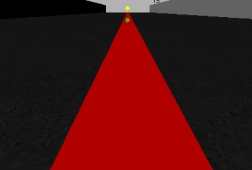
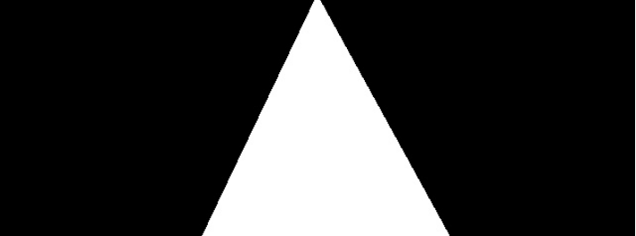
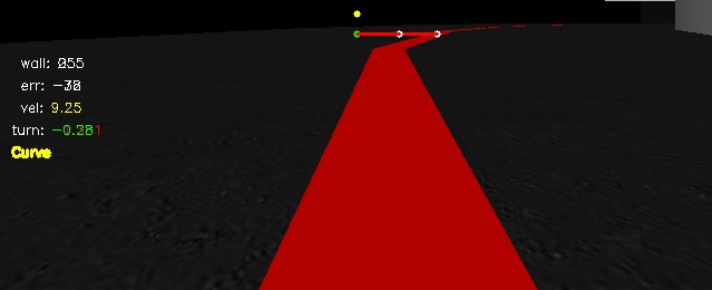

En esta página se explica la metodología empleada para el desarrollo de la práctica de **Sigue Línea** en la asignatura de Visión en Robótica del Máster Oficial en Visión Artificial.

<div style="text-align: center">
	
</div>


El **objetivo** de la práctica es aplicar comportamiento reactivo a un modelo de Fórmula 1 para que siga una línea roja pintada sobre el asfalto de la simulación. Con este comportamiento se pretende optimizar los valores de los actuadores del robot para que complete la vuelta en el menor tiempo posible.


### 1. Preproceso

Para que el robot simulador siga la línea se obtienen imágenes de una **cámara situada en el centro** del modelo. Estas imágenes pasan primeramente por una función que procesa el contenido capturado. Dado que buena parte de la imagen pertenece al cielo de la escena, se procesa el contenido de la imagen de retorno a partir de la **mitad**, centrando la atención en la **mitad inferior** de la imagen que será donde ocurran los eventos.

Con la imagen recortada se procesa la imagen para extraer la línea roja del asfalto, que es la guía por donde el vehículo circula. Para esta extracción se decide pasar la imagen RGB que se obtiene de la cámara al modelo de color HSV por ser más robusto frente a cambios de iluminación y, por tanto, obtener valores más fiables e independientes de otros elementos.

Con este cambio en el modelo de color y fijados los valores del filtro se obtiene la línea roja. Puede verse en la siguiente imagen el resultado de la segmentación.

<p align="center">
  
</p>

Con la imagen segmentada se procede a la extracción de 2 líneas (filas). Utilizando la librería `numpy` se busca en estas líneas el punto central que existe entre los valores marcados como 255 (blanco) para extraer el centro de la línea. Este punto es el de referencia para las órdenes que se enviarán a los actuadores. 

### 2. Diseño
Dado que la imagen tiene un ancho de 640 píxeles, el punto central de la imagen se encuentra en el píxel 320. Las **diferencias** que existen **entre el punto central** de la imagen y el **valor calculado** a través de la extracción del punto centro de la fila **será la desviación cometida** con respecto al centro.

Esta desviación se clasifica como el **error** y es el parámetro en el que se basa la práctica. 


### 3. Comportamiento

Para corregir este error se diseña un **control proporcional** y derivativo (PD). Con este mecanismo de control se **corrige el error** proporcionado por la diferencia entre el centro de la imagen y el centro de la línea de manera proporcional (`Kp`), es decir, tanta corrección como desviación sufra el vehículo. Para **compensar las oscilaciones** proporcionadas por este controlador se añade la **componente derivativa** (`Kd`) que **suaviza** estos **cambios bruscos** calculando **diferencias entre el error actual y el anterior** para conocer si el error **aumenta** y, por tanto, hay que **corregir más** o **disminuye** y la componente proporcional tiene que **corregir menos** cantidad. 

La ecuación que sigue este controlador es la siguiente:

```python
correccion = kp * desviacion + kd * (desviacion - desviacion_anterior)
```

El ajuste de las constantes `Kp` y `Kd` serán las que permitan un funcionamiento más ajustado a la línea y suavidad en la corrección. Son valores que **se calculan de manera experimental** por lo que llevan tiempo adecuar estos valores al problema concreto.


### 4. Control Basado en casos.

Para poder ajustar la velocidad y aumentar el control sobre el vehículo **se construye otro** controlador PD muy similar al anterior. De esta manera y como se haría intuitivamente en un vehículo real, se **acelera** en los **tramos rectos** y se **frena** en las curvas o situaciones donde se desvía mucho de la línea. Para este control se implementa un **control basado en casos** que discrimine entre **Recta** o **Curva**. 

Para detectar la **recta** se ajusta un **rango de valores** de desviación con respecto al centro de +/- 15 píxeles por lo que si el punto central de la línea se encuentra a esa distancia con respecto al centro de la imagen el vehículo se encuentra en una recta y por tanto acelera. 

Para el otro caso, se detectará **curva si no cumple** con el rango de valores estimado en el paso anterior, por lo que **reduce la velocidad**. Aplicando lo conocido para un control PD no disminuye la velocidad de manera constante ni brusca si no en función del segundo punto de estudio de la imagen, **la pared**. 

<p align="center">
  
</p>


El **estudio** del nivel de intensidad **de las paredes** proporciona información de cómo de cerca está el coche de una de ellas. En este caso se asume que un **valor 0** de nivel de intensidad en el punto corresponde a una **pared muy próxima** y por lo tanto se tiene que **reducir la velocidad**. Es aquí donde entra en juego el segundo controlador PD. Las **diferencias entre niveles de intensidad** de la pared harán incrementar la velocidad del fórmula 1 hasta alcanzar la máxima fijada. Este estudio de la pared está representado en el GUI mediante un **punto amarillo** (*wall* en la telemetría).

En el siguiente vídeo puede verse el resultado del algoritmo que lleva a realizar la vuelta al circuito en aproximadamente **47 segundos**.

<div style="text-align: center">
    <video width="600px" height="400px" controls preload> 
        <source src="./img/follow_line_solution.mp4"></source> 
    </video>
</div>


### 5. Conclusiones

El resultado de la práctica ha ido siendo satisfactorio cada pequeño reto que se iba afrontando, desde la segmentación de la imagen, extracción de las líneas de interés, tratamiento de los puntos de interés,  actuación en función de los casos que se planteaban y el ajuste de parámetros. Dado que no he utilizado nunca el control PD el resultado final deja claro que este tipo de control permite llevar más allá un algoritmo que pueda tener limitaciones ya que los cambios son progresivos y permite mejor regulación.

El punto de  mejorar el tiempo marcado con una configuración de parámetros en cada vuelta daba ese toque *adictivo* al desarrollo de la práctica.
