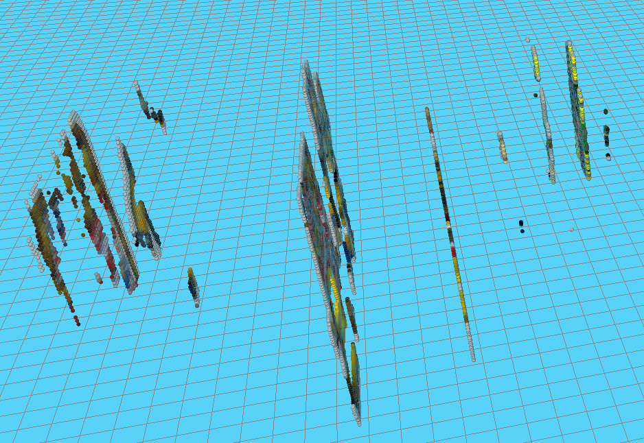

Esta segunda práctica de la asignatura de Visión en Robótica consiste en reconstruir una escena 3D a partir de las imágenes que recoge un robot a través de las cámaras de un par estéreo canónico. Utilizando las propiedades vistas durante el transcurso de la asignatura se pretende obtener correspondencias entre una imagen y la otra para obtener una recontrucción del punto en un espacio tridimensional ofrecido por la plataforma Unibotics.

Este proceso de reconstrucción, así como el código desarrollado, siguen una serie de etapas que se detallan a continuación:

### 1. Preproceso
Partiendo como imagen fija la cámara izquierda, se buscan puntos de interés sobre la esta cámara. Estos puntos son obtenidos utilizando el filtro de Canny para obtener bordes. Inicialmente se parte de un umbral donde se detectan pocos puntos para que sea más cómodo trabajar en las primeras iteraciones con el programa. Posteriormente se incrementará el número de puntos como se verá más adelante.

Una vez se tienen estos puntos de interés representada por una nueva imagen con los píxeles con valor 255 donde existe un borde, comienza la siguiente etapa.


### 2. Retroproyección
Utilizando el API ofrecido por la plataforma, se toma un punto de los almacenados como puntos de interés para, pasarlo de coordenadas gráficas (píxeles) a coordenadas ópticas y retroproyectarlo.


```python
pointInOpt = self.camLeftP.graficToOptical(point)
point1_3D_Left = self.camLeftP.backproject(pointInOpt)
```

El resultados de esta operación es un punto (no definido) en el espacio. Este punto, junto con el centro óptico de la cámara, unidos, forman el rayo de retroproyección. Será en este rayo donde se encuentre el punto correspondiente en la otra cámara, el cual se buscará a través de la **línea epipolar**.


### 3. Epipolar
Para reducir el tiempo de búsqueda del punto correspondiente en la cámara derecha, se limita la búsqueda a una línea, la línea epipolar. Ese tiempo de búsqueda de la correspondencia se reduce aún más si se limita a unos pocos puntos de esa línea. Dado que la distancia entre las cámaras es pequeña, no será necesario buscar más allá de unos pocos píxeles. Para esta práctica, esa limitación está en 15 píxeles hacia la izquierda (como se busca en la cámara derecha, la mejor correspondencia estará hacia la izquierda).


<div style="text-align: center">
    
</div>


### 4. Matching
Para saber cómo de buena es la correspondencia se utiliza la función de openCV `matchTemplate` con la métrica `CCORR_NORMED` que devuelve una medida de correlación. Esta medida se realiza entre **dos recortes** tomados, uno de cada imagen. Fijando un recorte de la cámara izquierda, se extrae, en el mismo punto, uno en la imagen derecha y se mide el parentesco. Esto se repite desplazándose hacia la izquierda en busca la mejor medida de correspondencia. De los 15 píxeles de desplazamiento máximos se retornará de la función `matching` el que mayor correlación tenga. Ese será el recorte que mejor parentesco tiene con el correspondiente de la cámara izquierda y el centro del recorte será la coordenada del píxel que se retroproyecta en la siguiente etapa.


### 5. Nueva retroproyección
Con la coordenada de la cámara derecha del mejor píxel obtenido tras la correlación se repiten los pasos para obtener el punto en 3D que, de igual manera, unido con el centro óptico, se obtiene el nuevo rayo de retroproyección. Esta vez de la cámara derecha.

En el siguiente vídeo puede verse qué ocurre si representamos en el espacio los puntos de retroproyección en ambas cámaras. En color negro están los puntos retroproyectados de la cámara derecha y en blanco los de la cámara izquierda. Con esta disparidad se calcularán las interrecciones. Estas íntersecciones estarán más próximas a punto desde donde se está visualizando esta escena.

<div style="text-align: center">
    <video width="800px" height="500px" controls preload>
        <source src="./img/reconstruccion_trazas.mp4"></source> 
    </video>
</div>

### 6. Intersección entre los rayos, triangulación.
Idealemente ambos rayos deberían coincidir en un punto común que coincidiría con el punto tridimensional. En la realidad, eso no ocurre, por lo que se tiene que buscar el punto donde la distancia entre dos rectas sea más pequeña. Para esta relación se utiliza las ecuaciones para obtener la distancia mínima entre dos rectas en [este enlace](http://paulbourke.net/geometry/pointlineplane/). Donde cada uno de los puntos representa la posición del centro óptico de la cámara izquierda, derecha así como los puntos retroproyectados. El punto medio entre las distancias será el punto final que se utilizará en la siguiente etapa.

### 7. Resultados
Una vez se completan los pasos anteriores, la última etapa es la representación en el Canvas 3D de la plataforma. Para ello se obtiene (usando las cooredenadas de la imagen izquierda) el color del pixel para que el resultado se obtenga en color. Pasados aproximadamente 90 segundos se obtiene el resultado que se puede ver en la figura.


<div style="text-align: center">
    
</div>


Puede verse el proceso de la reconstrucción en el siguiente vídeo:


Las zonas huecas que se ven en la solución (interior del patito de goma) ocurre porque no se han sacado puntos de interés en ese área (caen como si se trataran de fondo) y generan el hueco.

Si lo visualizamos desde otro ángulo, podemos ver los planos formados a distinta profundidad. Debido a la resolución de las imágenes que se obtienen desde las cámaras, se ven claramente los distintos planos de profundidad. Esto es debido a que, objetos más cercanos tienen más disparidad que los lejanos. Dado que la resolución de las imágenes es de 320x240 existen unas limitaciones a la hora de obtener correspondencias. A medida que la resolución de la cámara aumenta es posible obtener más planos en la disparidad, lo que se traduciría en mayor número de planos de imagen de los que se ven en la siguiente imagen.





El número de puntos que se han representado son, aproximadamente, 23580 en 1:30 minutos.

### 8. Conclusiones
Se ha solucionado la práctica de reconstrucción 3D de una escena empleando dos cámaras en un par estéreo y midiendo, en la línea epipolar, el parentesco entre parches de las imágenes con el fin de obtener la triangulación y representarse en el espacio 3D.

Una vía para mejorar esta reconstrucción sería obtener más puntos ya que se obtendrían todos los píxeles de los objetos de la escena. Dado que sería muy posible que en este proceso se incluyera más ruido también sería necesaria una comprobación que descartara posibles puntos que no pertenecen a los objetos.

Como conlusión personal, tanto esta como la anterior, han sido prácticas muy interesantes de realizar que han permitido explotar la plataforma mostrando las ventajas de programar en un entorno web.